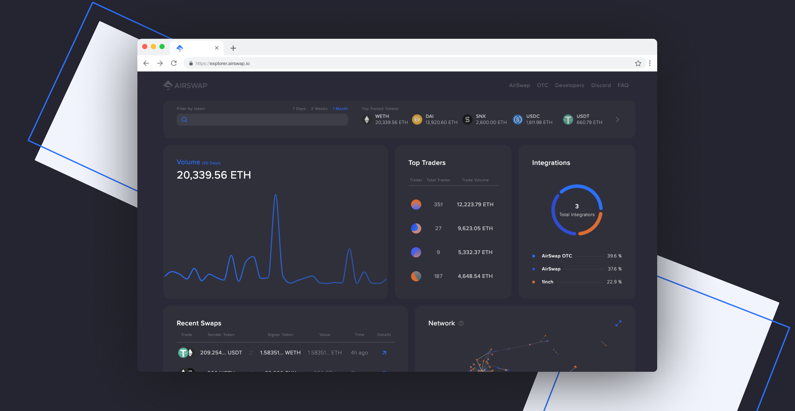

## AirSwap Explorer UI

[AirSwap](https://www.airswap.io/) is a peer-to-peer trading network for Ethereum tokens. Peers connect based on common interest, agree on a price through mutual cryptographic signatures, and settle trades without intermediaries. [AirSwap Explorer](https://explorer.airswap.io/) is an open-source interface to monitor real-time activity on the AirSwap network.

## Resources
Docs → [https://docs.airswap.io/](https://docs.airswap.io/)

Website → [https://www.airswap.io/](https://www.airswap.io/)

Whitepaper → [https://swap.tech/whitepaper/](https://swap.tech/whitepaper/)

Twitter → [https://twitter.com/airswap?lang=en](https://twitter.com/airswap)

Discord →  [https://chat.airswap.io](http://chat.airswap.io)

## Run Locally
This repository uses .nvmrc to manage node version, so run `nvm install` before `yarn` to make sure you are running the correct node version.

## Contributions
Contributions are encouraged! Simply fork this repository or create a new branch and open a pull request.
